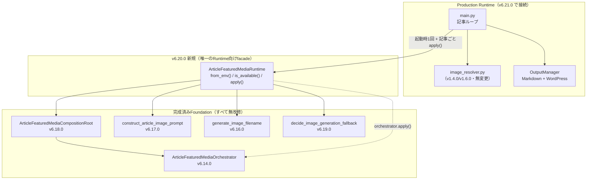
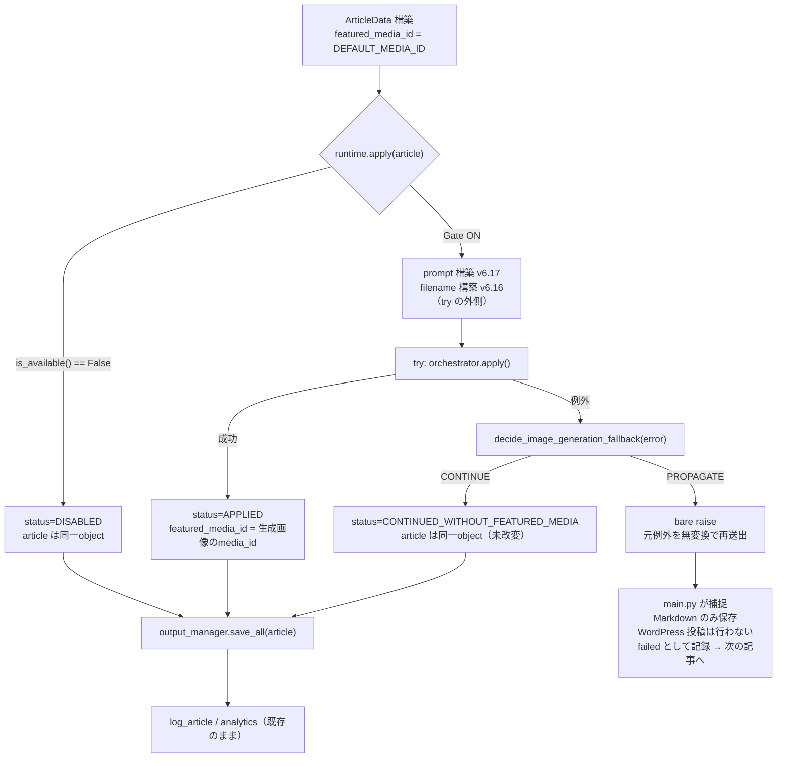

# Article Featured Media Runtime Wiring（DI-4）— Architecture Design

> **本設計書は Deferred Item DI-4（`docs/ROADMAP.md`「Article Featured Media Runtime Wiring」）の
> Architecture Design である。** Release 6.9.0〜6.19.0 で整備された画像系11 Foundation を、
> 既存の記事生成 Runtime（`main.py`）へ実際に接続するための設計を確定する。

---

## 0. Status

本設計書は v6.20.0／v6.21.0 の2 Releaseを横断して規定するため、Status を Release ごとに分離する
（Amendment 1、m-5対応）。

### 0.a v6.20.0（Article Featured Media Runtime Foundation）Status

| 項目 | 内容 |
|---|---|
| **工程** | Architecture Design → Architecture Review 1（Changes Required）→ Architecture Amendment 1（Completed）→ Architecture Review 2（Approved with Suggestions）→ Architecture Amendment 2（Completed） |
| **Production Implementation** | Completed |
| **New E2E** | 23 Scenario prefix・197アサーション・197/197 PASS |
| **Production Code Review** | Approved with Suggestions（Blocking 0件・Major 0件・Minor 1件・Suggestion 3件） |
| **Production Implementation Correction** | Completed（Minor-1・Suggestion-1を解消。Suggestion-2・Suggestion-3は非Blockingのまま残存） |
| **Formal Regression** | Completed（正式Inventory23ファイル、3241/3241 PASS） |
| **Documentation Integration** | Completed |
| **Release Review** | Approved with Suggestions（Blocking 0件・Major 0件・Minor 2件・Suggestion 1件、0.e節参照） |
| **Release** | **Completed** |

### 0.b v6.21.0（Article Featured Media Runtime Wiring）Status

| 項目 | 内容 |
|---|---|
| **工程** | Architecture Design → Architecture Review 1（Changes Required）→ **Architecture Amendment 1（本工程で完了）** |
| **Architecture Review 2** | Not Started |
| **Production Implementation** | Not Started |
| **New E2E** | Not Started |
| **Formal Regression** | Not Started |
| **Documentation Integration** | Not Started |
| **Release Review** | Not Started |
| **Release** | Not Started |

### 0.c Architecture Review 1 の結果と本Amendmentの対応

Architecture Review 1（Blocking 1件・Major 2件・Minor 5件・Suggestion 3件、
Verdict: Changes Required）を受け、本 Architecture Amendment 1 で Blocking 1件・
Major 2件・Minor 5件をすべて解消した。Suggestion 3件のうち S-1・S-3 は反映し、
S-2 は理由を記録のうえ不採用とした。対応内容の詳細は本文の該当節、および
23章「Architecture Amendment 1 変更履歴」に記録する。

**本工程（Architecture Amendment 1）で変更したファイル**：本設計書1ファイルのみ。
Production Code・tests・`docs/ROADMAP.md`・`docs/architecture.md`・`docs/CHANGELOG.md`
はいずれも無変更である。

**Repository 開始状態**：branch `main`、local HEAD = `origin/main` =
`7284ca98d06fc985aa05faa8df0206deee4810b8`（Release 6.19.0）、ahead／behind 0／0、
Working Tree clean。

### 0.d v6.20.0 Documentation Integration

Formal Regression（正式Inventory23ファイル、3241/3241 PASS）完了後、v6.20.0の
Documentation Integrationを実施した。

**本工程で変更したファイル**：`docs/ROADMAP.md`（DI-4該当箇所をv6.20.0完了済み
＋v6.21.0未着手の2エントリへ分割・更新）・`docs/architecture.md`（「Article
Featured Media Runtime Foundation層」節を新規追加）・`docs/CHANGELOG.md`
（`[v6.20.0]`Entryを新規追加）・本設計書（0.a節Statusの更新のみ）。
Production Code・testsは無変更。v6.21.0の`main.py`配線・v6.13.0 Guard精緻化は
未実施のまま。

### 0.e v6.20.0 Release Review の結果と反映（Documentation Integration Finalize）

Release Review（Verdict: Approved with Suggestions、Blocking 0件・Major 0件・
Minor 2件・Suggestion 1件）を受け、Documentation Integration Finalizeとして
以下を解消した。

```text
[Minor]
RR-M-1  docs/ROADMAP.mdのv6.20.0 Entryが`[x]`（完了マーク）でありながら、
        本文が「Release Reviewは未実施であり未完了」と記述しており、
        一時的に矛盾していた（v6.17.0のRR-M-1「ROADMAP Entryの`[x]`と
        Release未実施表現の一時併存」と同型の既知パターン）
        → 本Release Reviewの完了（Approved with Suggestions・Release：
          Completed）に合わせて、docs/ROADMAP.mdの本文記述をRelease完了状態へ
          更新し、`[x]`表記との矛盾を解消した

RR-M-2  本設計書冒頭2箇所（表題直下・2.1節冒頭）が「画像系10 Foundation」
        「10個の Foundation」と誤記していたが、直後のテーブルはv6.9.0〜
        v6.19.0の11行を列挙しており、テーブル直後の文も「これら11 package」
        と正しく11と記載していた（本文内で自己矛盾）
        → 該当2箇所を「11 Foundation」「11個の Foundation」へ訂正した
          （テーブルの内容・行数は無変更）

[Suggestion]
RR-S-A  tests/test_e2e_v6_20_0_*.py冒頭docstringのScenario構成一覧が、
        Production Implementation Correctionで追加した`ARTICLETYPE-`を
        含まず22件のままだった（実体は23 prefix）
        → docstring一覧へ`ARTICLETYPE-`を実装順序どおり（RESULT-の次、
          DISABLED-の前）に追記した。テストロジック・アサーション内容は
          無変更
```

Public API・Facade責務・Gate→prompt→filename→orchestrator→fallback順序・
PROPAGATE時のbare raise・CONTINUE4 reason限定・秘密非保持・consumer-less／
Runtime Zero Diff・v6.21.0未着手・DI-10／DI-11 Deferredのいずれにも問題は
なく、Architectureからの逸脱もない。RR-M-1・RR-M-2・RR-S-Aはいずれも
ドキュメント記述の訂正のみで解消し、Production Code・testsのロジックは
変更していない。

**Release Reviewを経て、Release 6.20として完了した。**

### 0.1 本設計書が確定する Release

DI-4 は**2 Release へ分割する**（根拠は4章）。

| Release | 正式名称 | 主対象 | Runtime Zero Diff |
|---|---|---|---|
| **v6.20.0** | **Article Featured Media Runtime Foundation** | 新規package `src/article_featured_media_runtime/` | **維持**（consumer-less） |
| **v6.21.0** | **Article Featured Media Runtime Wiring** | `main.py` への配線 | **解除**（`main.py`のみ） |

v6.21.0 の正式名称は `docs/ROADMAP.md` の DI-4 Entry 名をそのまま維持する。
v6.20.0 の名称は、本Repositoryの既存 precedent
（v5.5.0 `Retry Runtime Loop Foundation` → v5.9.0 `Retry Runtime Loop Wiring Foundation`、
v5.6.0 `Retry Runtime Safe Dry Run Foundation` → v5.7.0 `Retry Runtime Safe Dry Run Wiring Foundation`）に
従い、「Foundation（消費者不在）→ Wiring（Runtime接続）」の対を成す命名として決定した。
Release番号は v6.19.0 の直後の連番であり、根拠のない飛び番・改称は行っていない。

---

## 1. ORD-1 再評価結果（必須事項・本Releaseの前提）

`docs/design/image_generation_fallback_policy_foundation.md` 10.8節 ORD-1 は、
DI-4 着手前に「DI-10／DI-11 の必要性」および「v6.19 が受諾した可用性トレードオフ
（10.4節 C-5・10.6節 C-10・10.7節 C-19）」を**正式に再評価すること**を必須としている。
本節をもって、その再評価を DI-4 Architecture Design の一部として実施した記録とする。

### 1.1 再評価の結論

```text
ORD-1  実施済み。本節が正式な再評価記録である。
ORD-2  【適用】v6.19 の安全側契約（安全に分類できない失敗はすべて元例外を伝播する）を
       **そのまま受容する**。したがって DI-10／DI-11 は未完了のまま DI-4 へ着手する。
ORD-3  【非該当】CONTINUE 対象の拡大は行わない。
ORD-4  【非該当】現在の可用性低下を受容する（下記1.3）。
```

**本Releaseは v6.19.0 の Contract を1文字も変更しない。**

| 分類 | reason／型 | Action |
|---|---|---|
| 画像なし継続 | `TIMEOUT` / `CONNECTION` / `RATE_LIMIT` / `SERVER_ERROR` | `CONTINUE_WITHOUT_FEATURED_MEDIA` |
| 元例外伝播 | `REQUEST_REJECTED` / `AUTHENTICATION` / `PERMISSION_DENIED` / `INVALID_RESPONSE` / `UNKNOWN` / 未知reason / reason属性欠落 / 未知Exception / `WordPressMediaUploadError`（全件） | `PROPAGATE_ORIGINAL_ERROR` |

### 1.2 DI-10／DI-11 を先行させない判断根拠（Repository の事実）

| # | 事実 | 判断への寄与 |
|---|---|---|
| **E-1** | `src/openai_image_generation/openai_image_generator.py` の `_classify_api_error()`（L97-148）は、`AuthenticationError` / `PermissionDeniedError` / `RateLimitError` / `APITimeoutError` / `APIConnectionError` / `BadRequestError`・`NotFoundError`・`ConflictError`・`UnprocessableEntityError` / `InternalServerError` を**例外型のみ**で分類し、`OpenAIImageGenerationErrorReason` 9値のうち8値を実際に生成できる（`INVALID_RESPONSE` は `_validate_response_structure()` / `_build_generated_image()` が生成）。v6.19 policy が期待する reason 語彙と**過不足なく一致**する | DI-11 未完了でも policy の入力側に欠落はない |
| **E-2** | DI-11 が対象とするのは `REQUEST_REJECTED` の**内訳細分化**のみである。`REQUEST_REJECTED` は現契約で `PROPAGATE_ORIGINAL_ERROR` であり、細分化しても本Releaseの制御フローは変わらない（細分化が意味を持つのは CONTINUE へ拡大する場合＝ORD-3 に限られる） | DI-11 は DI-4 の**前提ではない** |
| **E-3** | `src/wordpress_media/wordpress_media_uploader.py` の `WordPressMediaUploadError`（L24-26）は `RuntimeError` の空subclassであり、`reason`・status code のいずれも保持しない。timeout／connection／4xx／5xx の区別は**構造的に不可能** | DI-10 は「ゼロからの追加」であり独立Releaseを要する（v6.19 N-17と同一の判断） |
| **E-4** | 現契約では `WordPressMediaUploadError` は全件 `PROPAGATE_ORIGINAL_ERROR` である。分類が存在しない状態で CONTINUE へ拡大すると、capability不足による恒久的403が「毎回静かに画像なし記事を投稿し続ける」permanent silent degradation を生む（v6.19 Amendment 1 B-1） | 分類なしでの拡大は**禁止**。現契約の維持が唯一の安全な選択 |

### 1.3 受容する可用性トレードオフ（明示的受諾）

```text
T-A  一過性の WordPress Media Upload 障害（5xx・timeout 等）でも、
     その記事は投稿されない（PROPAGATE）。
T-B  Content Policy 拒否（REQUEST_REJECTED）でも、その記事は投稿されない。
T-C  model不存在・提供終了（同じく REQUEST_REJECTED へ集約）は全記事で反復し、
     結果としてその run では1件も WordPress へ投稿されない。
T-D  認証・権限不備（AUTHENTICATION / PERMISSION_DENIED）も同様に全記事で反復する。

上記はいずれも AI_IMAGE_GENERATION_ENABLED=true の場合にのみ発生する。
既定（false）では本Releaseの配線は一切作動せず、可用性は現状から変化しない（8章）。

上記トレードオフを受容する代わりに、本Releaseは次を保証する:
  ・失敗は silent ではない（記事は「投稿されなかった」ことが console・ArticleLog・
    ExecutionLog に必ず現れる。7.4節）
  ・生成済みの記事本文は失われない（Markdown へは保存される。7.4節 F-3）
  ・画像なしで恒久的に投稿し続ける状態（permanent silent degradation）は生じない
```

---

## 2. Context

### 2.1 これまでの経緯

Release 6.9.0〜6.19.0 で、画像 featured media に関する11個の Foundation が
**いずれも消費者不在（consumer-less）** の状態で整備された。

| Release | Package | 責務 |
|---|---|---|
| v6.9.0 | `src/wordpress_media/` | WordPress Media API への画像アップロード |
| v6.10.0 | `src/ai_image_generation/` | `AIImageGenerator` Protocol・`GeneratedImage` |
| v6.11.0 | `src/openai_image_generation/` | OpenAI Images API adapter・失敗分類 reason 9値 |
| v6.12.0 | `src/generated_image_wordpress_media/` | `GeneratedImage` → Media Upload の橋渡し |
| v6.13.0 | `src/article_featured_media/` | `media_id` → `ArticleData.featured_media_id` の binding |
| v6.14.0 | `src/article_featured_media_orchestration/` | generate → upload → bind の固定順序 orchestration |
| v6.15.0 | `src/image_generation_config/` | Gate（`AI_IMAGE_GENERATION_ENABLED`、Fail Closed） |
| v6.16.0 | `src/generated_image_filename_policy/` | filename の決定論的構築 |
| v6.17.0 | `src/article_image_prompt_construction/` | prompt の決定論的構築 |
| v6.18.0 | `src/article_featured_media_composition/` | 上記の構築・接続（Composition Root） |
| v6.19.0 | `src/image_generation_fallback_policy/` | 失敗時の継続／伝播の判断 |

**これら11 package のいずれも、`main.py` から参照されていない。**
`AI_IMAGE_GENERATION_ENABLED=true` にしても、現時点では画像は1枚も生成されない。

### 2.2 本Releaseが解く問題

v6.19.0 は「どう判断するか」を確定したが、「誰がその判断を消費するか」は
DI-4 の責務として明示的に残された（v6.19 §13.3 Q-4・§21.6 W-1〜W-4・N-20・N-21）。
本設計はその**唯一の消費者**を定義し、既存の記事生成 Runtime へ接続する。

### 2.3 v6.19 から DI-4 への申し送り事項（必ず満たすべき Contract）

`docs/design/image_generation_fallback_policy_foundation.md` §21.6 より：

```text
W-1  callerが捕捉した元例外を無変換で再送出すること（bare `raise`）
W-2  再送出された例外を上位Runtimeがどう処理するか（記事単位／run単位）を決めること
W-3  try 範囲（prompt／filename構築を含めるか）を決めること（N-20）
W-4  BaseException を捕捉しないこと（`except Exception` に限定すること）

DI-4 のReviewerが確認すべき事項（v6.19からの申し送り）:
  ・`except Exception` であり `except BaseException` でないこと
  ・PROPAGATE 分岐が bare `raise` であること
  ・CONTINUE 分岐で ArticleData を改変しないこと
```

本設計は W-1〜W-4 のすべてに回答する（7章・9章）。対応表は 20.2節に示す。

---

## 3. Current Architecture（Repository の事実）

### 3.1 記事生成 Runtime の現在の構造

`main.py` の記事ループ（L310-392）は次の順序で1記事を処理する。

```text
L318  article_body = generate_article(client, item, importance)      # Claude API
L319  seo_title    = generate_seo_title(client, item, importance)    # Claude API
L322  slug         = generate_slug(seo_title, date_str)
L329  x_post       = generate_x_post(...)                            # Claude API
L335  excerpt            = _extract_excerpt(article_body)
L336  featured_image_url = resolve_featured_image(item)              # image_resolver（v1.4.0）
L337  featured_media_id  = resolve_media_id(item, default_media_id)  # image_resolver（v1.6.0）
L338  publish_status     = publishing_config.resolve_status(importance)
L339  article = ArticleData(...)                                     # ← ここで確定
L353  save_results = output_manager.save_all(article)                # ← Markdown + WordPress
L367  log_manager.log_article(...)
L378  analytics_manager.create_placeholder_entry(...)
```

### 3.2 設計を拘束する Repository の事実

| # | 事実 | 出典 | 設計への拘束 |
|---|---|---|---|
| **S-1** | `WordPressOutput.save()` は `POST /wp-json/wp/v2/posts`（**新規作成のみ**）である。記事更新API・`featured_media` の後付け設定手段は**存在しない** | `src/outputs/wordpress_output.py` L53, L69-74 | 画像処理は**下書き作成より前**に完了していなければならない（6章） |
| **S-2** | `featured_media` は payload 構築時（`save()` 内 L66-67）に `article.featured_media_id > 0` の場合のみ付与される | 同 L66-67 | `featured_media_id` は `save_all()` 呼び出し**前**に確定していればよい |
| **S-3** | `OutputManager.save_all()` は出力先ごとに `except Exception` で捕捉し、1つが失敗しても他を続行する | `src/outputs/manager.py` L36-45 | 「記事1件の失敗 ≠ run全体の停止」が本Repositoryの既存規範（v6.19 S-12〜S-14） |
| **S-4** | `MarkdownOutput` は `featured_image_url` のみを HTMLコメントとして記録し、`featured_media_id` を**出力しない** | `src/outputs/markdown_output.py` L48-49 | 画像生成の成否は Markdown 出力に影響しない（後方互換上重要） |
| **S-5** | `WordPressMediaUploader.upload()` は `media_id < 1` を成功として返さない（例外送出） | `src/wordpress_media/wordpress_media_uploader.py` L180-184 | Upload成功後に `bind_featured_media()` が `ValueError` を出す経路は**構造的に到達不能**（防御的分岐に留まる） |
| **S-6** | `ArticleFeaturedMediaCompositionRoot.from_env()` は Gate OFF なら追加の環境変数を一切読まず `orchestrator=None` を返し、Gate ON かつ credential 不足なら既存factoryの `ValueError` を無変換伝播する | `src/article_featured_media_composition/article_featured_media_composition_root.py` L84-101 | 設定不備は**起動時**に確定できる（8章） |
| **S-7** | `OpenAIImageGenerator.from_env()`・`WordPressMediaUploader.from_env()` が送出する `ValueError` の message は**環境変数名のみ**を含み、値を含まない | `openai_image_generator.py` L242,L250,L252 / `wordpress_media_uploader.py` L127-129 | 起動時エラーメッセージを console へ表示しても秘密は漏れない（11章 SEC-4） |
| **S-8** | `WordPressMediaUploadError` の message は WordPress 応答本文由来の `code` / `message` を（sanitize・truncate のうえ）**含みうる** | `wordpress_media_uploader.py` L63-89, L166 | 本Releaseは `str(error)` を**log・console へ出力してはならない**（11章 SEC-2） |
| **S-9** | `NewsPipelineRunner` は `main.py` を subprocess 起動する薄いラッパーであり、`main.py` 本体には一切手を加えない設計である | `src/pipeline/news_pipeline_runner.py` docstring | `main.py` の変更は Agent／Scheduler の**契約変更を伴わずに**伝播する |
| **S-10** | 既存 E2E の Runtime Zero Diff ガード（v6.14〜v6.19）は `main.py` が各package**名**を参照していないことを検査する（`file_references_name()` / AST の `absolute_roots`）。git diff によるバイト差分検査は明示的に対象外である | `tests/test_e2e_v6_14_0_*.py` L1373-1387 ほか、`tests/test_e2e_v6_19_0_*.py` L1267-1275 | `main.py` が参照する新規package名を**1つに絞れば**、既存ガードを1件も壊さずに配線できる（5.3節） |
| **S-11** | `LogManager.log_article()` は `result` / `error_message` / `post_id` を引数に取り、schema変更なしで「失敗」を記録できる | `src/logger/log_manager.py` L97-107 | 部分成功状態の記録に既存APIを再利用できる（7.4節） |
| **S-12** | `.env.example` には `AI_IMAGE_GENERATION_ENABLED` / `OPENAI_API_KEY` / `OPENAI_IMAGE_TIMEOUT_SECONDS` が既に記載済みである（L188-196） | `.env.example` | 本Releaseで新規環境変数は追加されない（8章） |

---

## 4. Decision — Release 境界（DI-4 を2 Releaseへ分割する）

### 4.1 結論

**DI-4 は v6.20.0（Foundation）と v6.21.0（Wiring）の2 Releaseへ分割する。**

分割の根拠は「変更量が多いから」ではなく、次の4観点すべてで境界が成立するためである。

| 観点 | 根拠 |
|---|---|
| **責務** | v6.20.0 は「1記事に対する featured media 適用と失敗分類の消費」という**業務判断**を担う。v6.21.0 は「その判断をどの位置で・どのライフサイクルで呼び、失敗をどう記録するか」という**Runtime制御**を担う。両者は Review で見るべき観点がまったく異なる（前者＝失敗タクソノミの正しい消費、後者＝既存記事パイプラインの不変性） |
| **依存関係** | v6.20.0 は完成済み Foundation（v6.13〜v6.19）にのみ依存し、新規の未確定要素を持たない。v6.21.0 はそれに加えて「記事ループの失敗時制御」「ExecutionLog のセマンティクス」という既存Runtime側の判断を要する |
| **Runtime安全性** | v6.20.0 は Runtime Zero Diff を**維持**する。すなわち中間状態（v6.20.0 完了・v6.21.0 未着手）でも、既存の記事生成は1バイトも変化しない。失敗タクソノミ全体を、本番経路へ触れる前に完全検証できる |
| **E2E検証可能性** | 本設計の Test Strategy が要求する検証項目のうち、**大半（全9 reason・未知reason・reason欠落・`WordPressMediaUploadError`・未知Exception・元例外同一性・画像なし継続・秘密非保持）は v6.20.0 単独で決定的に検証できる**。`main.py` を必要とするのは「Gate OFF時の既存挙動同一性」「他経路非影響」「呼び出し位置」等に限られる（14章） |

### 4.2 却下した代替案

| 案 | 却下理由 |
|---|---|
| **1 Release で完結** | 失敗タクソノミの検証と、記事パイプラインの不変性検証を同一 Review・同一 Regression で扱うことになる。v6.19 が4回の Architecture Review を要した領域であり、そこへ `main.py` 変更（本Repositoryで初めて publish 本経路へ触れる変更）を同時に載せると、不具合発生時の切り分け対象が「新規判断ロジック」と「既存Runtime配線」の両方へ広がる。中間状態での安全な停止点も失われる |
| **3 Release 以上へ分割**（例：prompt／filename 構築層をさらに分離） | prompt 構築（v6.17.0）・filename 構築（v6.16.0）は既に独立 package として完成しており、v6.20.0 が行うのはその**呼び出し**のみである。これ以上の分割は責務境界を持たない純粋な機械的分割であり、consumer-less Foundation を不必要に1つ増やす |

### 4.3 中間状態の安全性（v6.20.0 完了・v6.21.0 未着手）

```text
・main.py・image_resolver.py・outputs／pipeline／scripts はいずれも無変更
・AI_IMAGE_GENERATION_ENABLED=true にしても画像生成は一切実行されない
  （v6.15〜v6.19 と同じ consumer-less 状態が継続する）
・既存 Formal Regression Inventory（22ファイル・3044アサーション）の baseline を完全維持する
```

---

## 5. Target Architecture

### 5.1 レイヤ構成



### 5.2 責務配置の確定

| 責務 | 担当 | 根拠 |
|---|---|---|
| 失敗の**分類** | `decide_image_generation_fallback()`（v6.19.0・無改修） | 既に確定済み |
| 失敗の**分類の消費**（継続するか伝播するか） | **`ArticleFeaturedMediaRuntime.apply()`（v6.20.0 新規）** | application 層。provider adapter に業務判断を持たせない（下記5.4） |
| 伝播された例外の**受け止め**（記事単位か run 単位か） | **`main.py`（v6.21.0）** | v6.19 Q-4・N-21 が DI-4／既存Runtime境界の責務と規定 |
| prompt／filename の**構築** | v6.17.0／v6.16.0（無改修）。呼び出しは `ArticleFeaturedMediaRuntime.apply()` | — |
| dependency の**構築・接続** | v6.18.0 Composition Root（無改修） | — |

### 5.3 なぜ facade（class）にするか — 既存 Architecture Guard の破壊を最小化するため（Amendment 1で訂正）

S-10 のとおり、v6.14.0〜v6.19.0 の E2E は「`main.py` が当該package名を参照していないこと」を
恒久的な静的検査として固定している。`main.py` が Composition Root・prompt・filename・policy を
**直接**呼ぶ設計にすると、v6.14／v6.16／v6.17／v6.18／v6.19 の各ガードが恒久的に FAIL し、
`[KI-3]`〜`[KI-15]` と同型の Known Issue を4〜5件同時に発生させる。

本設計では `main.py` が参照する新規package名を **`article_featured_media_runtime` の1つだけ**に絞る。
`article_featured_media_composition`（v6.18）を含む既存package名はいずれも `main.py` に現れない。

**（Amendment 1で訂正）v6.14／v6.15／v6.16／v6.17／v6.18／v6.19 の各ガードは、上記の設計により
実際に PASS し続ける見込みである。ただし v6.13.0 のガードは例外である（確認済み事実）。**
`tests/test_e2e_v6_13_0_article_featured_media_binding_foundation.py` の RUNTIME-1（L826-834）は
`main.py` に対して `file_references_name(_path, "article_featured_media")` という**単純な部分
文字列一致**で検査しており、新package名 `article_featured_media_runtime` は部分文字列
`"article_featured_media"` を**含む**。したがって `main.py` が本 Facade を import した時点で、
このガードは**確実に FAIL する**（[KI-4] のテスト17と同型の恒久差分。`git diff` ベースではなく、
commit 後も解消しない）。

**したがって「既存 Architecture Guard を1件も破壊しない」という当初の主張は撤回する。**
この1件の衝突を解消する手段として、package 改名（衝突の回避）は採らない。理由は、
Facade 名 `article_featured_media_runtime` が v6.14〜v6.19 の命名（`article_featured_media_
orchestration` / `article_featured_media_composition` 等）と一貫しており、この一貫性を保つ方が
Repository 全体の可読性に資すると判断したためである（Amendment 1、Suggestion S-1 検討）。
代わりに、**v6.13.0 Guard 自体の精緻化**（部分文字列一致 → AST厳密一致）で解消する（5.5節）。
この精緻化は Guard の検査意図（`main.py` が v6.13.0 の低レベル binder を直接 import しないこと）
を変更せず、判定手法のみを是正する。

facade 設計そのものの利点（main.py が参照する画像系package名を1つに限定すること）は維持され、
v6.14〜v6.19 の6ガードは実際に PASS し続ける。「Known Issue 追加ゼロ」を実現するのは
package 名の選択ではなく、5.5節で定義する Guard 精緻化である。

### 5.4 provider adapter へ継続判断を持たせない保証

```text
・OpenAIImageGenerator（v6.11.0）は無改修。generate() は例外を送出するのみで、
  「継続してよいか」を一切判断しない
・ArticleFeaturedMediaOrchestrator（v6.14.0）は無改修。apply() は try/except を持たない
・継続／伝播の判断は decide_image_generation_fallback() のみが行い、
  その消費は ArticleFeaturedMediaRuntime.apply()（application層）のみが行う
```

### 5.5 v6.13.0 Architecture Guard の精緻化方針（Amendment 1 新設）

**対象**：`tests/test_e2e_v6_13_0_article_featured_media_binding_foundation.py` の
RUNTIME-1（main.py分の検査、L826-834相当）**のみ**。同ファイルの他の検査、および
他の21ファイル（正式Formal Regression Inventory 22ファイルから本精緻化の対象1件を
除いた件数。Amendment 2で「20ファイル」から訂正）は対象外・無変更。

**現在の検査（単純部分文字列一致）**：
```python
check_false(
    f"RUNTIME-1. {_label}にarticle_featured_mediaという文字列が含まれない",
    file_references_name(_path, "article_featured_media"),
)
```

**精緻化後の検査（AST の import root 名による厳密一致）**：
```python
_details = get_import_details(_path)
check_false(
    f"RUNTIME-1. {_label}が低レベルpackage article_featured_mediaを直接importしていない（AST厳密一致）",
    "article_featured_media" in _details["absolute_roots"],
)
```

**この変更が Guard の本来の意図を保つ理由**：

```text
G-1  get_import_details()（AST ベース）が返す absolute_roots は、import X /
     from X import Y の X を Python 識別子として**厳密一致**で収集する。
     部分文字列 in 判定と異なり、article_featured_media_runtime は
     article_featured_media とは**異なる識別子**であるため、
     Facade の import では一致しない
G-2  test_e2e_v6_13_0_*.py の DEP-2（同ファイル内、L805-816）は既にこの手法
     （_details["absolute_roots"]）を package 間 reverse dependency 検査に
     用いている。本精緻化は**同一ファイル内の既存手法を RUNTIME-1 へ適用するだけ**
     であり、新しい検査手法を持ち込まない
G-3  （Amendment 2で正確化）**維持する目的**は不変：「main.py が v6.13.0 の
     低レベル binder（article_featured_media）へ依存してはならない」。
     ただし**検出範囲は意図的に狭める**：現行の `file_references_name()` は
     コメント・文字列リテラル・docstring を含む**あらゆるテキスト参照**を
     検出する設計（同ファイル L216-219 のdocstring「importに限らずコメント等も
     含めた参照非存在の確認」）だが、精緻化後は AST の `absolute_roots` で
     識別できる**静的import のみ**を検出対象とする。
       許可：`article_featured_media_runtime` Facade への静的import
       禁止：低レベル package `article_featured_media` への
             `import article_featured_media` ／
             `from article_featured_media import ...`
             （`as` によるaliasを含む。`get_import_details()` はモジュール名の
             最上位コンポーネントで判定するため、alias は判定に影響しない）
       検出対象外：動的import（`importlib.import_module("article_featured_media")`等の
             文字列引数によるimport）・文字列参照・コメント・docstring内の言及
     この限定は、承認済み Facade `article_featured_media_runtime` と低レベル
     package `article_featured_media` を**部分文字列一致では区別できない**という
     制約（5.3節で確認済みの事実）に対応するために必要なトレードオフであり、
     「検査意図・検査対象が完全に不変」という主張はしない
G-4  （Amendment 2で正確化）変わるのは判定方法および検出範囲：部分文字列一致
     （あらゆるテキスト参照を検出）→ AST厳密一致（静的importのみを検出）。
     Guard の削除・無条件緩和ではなく、Facade識別に必要な範囲までの
     **意図的な検出範囲の限定**である。この限定により本来Guardが検出しなくなる
     経路（動的import・文字列参照経由での低レベルpackage依存）は、v6.21.0の
     Production Codeがそもそもそれらの手段を用いない契約とすることで補う
     （15.2節・14.3節・20.2節 AC-6.21-12）
G-5  bind_featured_media 文字列検査（同RUNTIME-1、L835-838）は部分文字列一致の
     ままでよい。ArticleFeaturedMediaRuntime（Facade）の実装は bind_featured_media()
     を呼び出さず root.orchestrator.apply() を呼ぶのみであるため（10.1節）、
     文字列 "bind_featured_media" は main.py 中に出現せず、本Releaseと衝突しない
```

**禁止事項（本精緻化の範囲）**：

```text
・main.py が低レベル package article_featured_media（v6.13.0）へ直接依存することは
  引き続き禁止する（G-3）
・承認済み Facade article_featured_media_runtime（v6.20.0）への依存のみを許可する
・RUNTIME-1 の削除・無条件コメントアウト・skip化は行わない
・test_e2e_v6_13_0_*.py の他の検査（DEP-2・bind_featured_media検査・
  image_resolver.py／wordpress_output.py分のRUNTIME-1等）には一切手を加えない
・他の21ファイル（Amendment 2で「20ファイル」から訂正。22ファイルbaselineから
  本精緻化の対象1件を除いた件数）の Architecture Guard には一切手を加えない
```

この変更は v6.21.0 の File Change Plan（15.2節）に「変更（Guard精緻化）」として計上し、
Formal Regression Inventory 上のファイル数（22→23→24）には影響しない
（既存ファイルの内容変更であり、新規ファイル追加ではない）。

---

## 6. Control Flow

### 6.1 処理順序の確定（画像処理は下書き作成の**前**）

**決定：`ArticleData` 構築の直後・`output_manager.save_all()` の直前に画像処理を行う。**

根拠は S-1（`WordPressOutput.save()` は新規作成のみで更新APIが存在しない）である。
「下書き作成 → 画像処理 → 記事更新」を採ると `WordPressOutput` への更新API追加
（v1.11.0 で確定した Public API の変更）が必須となり、本Releaseの非目標
「WordPress記事生成全体の再設計」に該当する。

この順序の**重要な帰結**：`PROPAGATE_ORIGINAL_ERROR` が発生する時点で
**WordPress 記事（投稿）はまだ1件も作成されていない**。したがって
「WordPress 記事が作成済みの状態で元例外を伝播する」という部分成功状態は原理的に発生しない
（7.5節 F-2）。

**（Amendment 1で明確化）これは「部分成功状態が一切あり得ない」という意味ではない。**
本節が否定するのは記事（WordPress投稿）レベルの部分成功のみである。Media Upload が
成功した後に何らかの理由で処理が中断する**Media レベルの部分成功**（orphan media）は、
構造的にはほぼ到達不能ながら理論上あり得ることを 7.5節 P-3・P-4 が別途規定しており、
本節の記述と矛盾しない（両者は異なるレイヤの部分成功を扱う）。

### 6.2 1記事あたりの制御フロー



### 6.3 全体順序（v6.21.0 適用後の `main.py` 記事ループ）

```text
 1. 記事本文生成（Claude）              既存・無変更
 2. SEOタイトル生成（Claude）           既存・無変更
 3. slug 生成 / X投稿文生成（Claude）   既存・無変更
 4. excerpt 抽出                        既存・無変更
 5. resolve_featured_image(item)        既存・無変更（URL候補）
 6. resolve_media_id(item, default)     既存・無変更（DEFAULT_MEDIA_ID）
 7. ArticleData 構築                    既存・無変更
 8. ★ runtime.apply(article)            ← 本Releaseで追加される唯一のステップ
      8-1 画像prompt構築（v6.17.0）
      8-2 filename構築（v6.16.0）
      8-3 OpenAI画像生成（v6.11.0）
      8-4 WordPress Media Upload（v6.9.0 / v6.12.0）
      8-5 Featured Media Binding（v6.13.0）
 9. output_manager.save_all(article)    既存・無変更（Markdown → WordPress下書き作成）
10. log_article / analytics             既存・無変更（PROPAGATE時のみ 7.4節の分岐）
```

---

## 7. Error／Fallback Semantics

### 7.1 捕捉境界（W-3 への回答）

```text
try の内側に置くもの:
    root.orchestrator.apply(article, prompt, filename)   ← この1呼び出しのみ

try の外側に置くもの:
    construct_article_image_prompt()   （v6.17.0）
    generate_image_filename()          （v6.16.0）
    is_available() の評価
    Decision の消費・戻り値の構築
```

**根拠**：prompt／filename 構築が送出する `ValueError` は provider 由来の失敗ではなく
**入力起因の検証エラー**である。これを policy へ渡すと `UNCLASSIFIED` へ丸められ、
「画像生成基盤の失敗」と「記事データの不備」が同一カテゴリへ混同される。
v6.19 §16.2 の参考イメージも try の外側に置いており、本設計はこれに一致する。

`ValueError` は `apply()` から**そのまま送出**され、`main.py` の同一境界（7.4節）が
受け止める。すなわち「その記事は失敗、次の記事へ」となり、run は停止しない。

### 7.2 捕捉してはいけないもの（W-4 への回答）

```text
・BaseException（KeyboardInterrupt / SystemExit / GeneratorExit）は捕捉しない。
  `except Exception` に限定する。Ctrl-C は従来どおり即座に run を終了させる
・try の外側で発生する一切の例外（Claude API・RSS収集・OutputManager・
  LogManager・AnalyticsManager 由来）は本Releaseの捕捉対象ではない
・output_manager.save_all() の内部例外は既存の OutputManager が処理する（S-3）。
  本Releaseはこれに一切干渉しない
```

### 7.3 `except Exception` の正当化（広範捕捉の限定）

`except Exception` は一般に忌避されるべきだが、本設計では次の理由により**この1箇所に限り**正当である。

```text
J-1  v6.19 の Contract が「未知Exception」を明示的に PROPAGATE 対象として
     含んでいる（UNCLASSIFIED）。すなわち捕捉すべき型を呼び出し側で列挙することは
     Contract 上**不可能**である。型を列挙する実装は、未知例外を policy へ到達させず、
     v6.19 の安全側 default を機能不全にする
J-2  捕捉範囲は「1つの関数呼び出し」に限定されており、複数の処理を含むブロックではない
J-3  捕捉した例外は握り潰されない。必ず policy へ渡され、PROPAGATE なら bare raise で
     再送出、CONTINUE なら status として呼び出し側へ返る（silent failure が構造的に生じない）
J-4  BaseException は捕捉しない（`except Exception` は BaseException 系を捕捉しない）
```

### 7.4 伝播された例外の受け止め（W-2 への回答）

**決定：記事1件の失敗として扱い、run は停止しない。次の記事へ進む。**

**（Amendment 1で明確化）この「記事1件の失敗として扱い run を止めない」という制御は、
既存 `main.py` の記事ループが元々持っていた契約ではない。** `main.py` の記事ループ
（L310-392）には現在 `try`/`except` が存在せず、既存の耐性は `OutputManager.save_all()`
内部（出力先単位、S-3）に限られる。したがって本節が定めるのは**DI-4 が新規に導入する
Runtime契約**である（12.2節 Scope に明記する）。

| # | 根拠 |
|---|---|
| **W2-1** | 本Repositoryの既存規範（S-3）：`OutputManager.save_all()` は出力先1つの失敗で run を止めない。本節はこの既存規範と同じ「1単位の失敗で全体を止めない」という設計思想を、記事ループのレベルへ新たに適用する |
| **W2-2** | v6.19 §13.3 Q-2「PROPAGATE は run 全体を停止することを意味しない」・Q-3「記事ループを打ち切ることを意味しない」と整合する（v6.19 はこの解釈を許容しているが、実装そのものは求めていない） |
| **W2-3** | 一過性の失敗（`INVALID_RESPONSE`、単発の WordPress 5xx）で、既に生成済みの他記事の処理まで失われることを避ける |

`main.py` 側の処理（PROPAGATE 時）：

```text
F-1  WordPress への投稿は行わない（画像なしでの投稿＝silent degradation を避ける）
F-2  この時点で WordPress 記事は未作成であるため、WordPress 側に中途半端な記事は残らない（6.1節）
F-3  Markdown ファイルは保存する（MarkdownOutput.save() を直接呼ぶ）。
     既存挙動「生成した記事は必ずローカルへ残る」を暗黙に削除しないため。
     WordPress 未設定時に Markdown のみ保存される既存状態（wp_skipped 経路）と同じ着地点である。

     ★（Amendment 1で追加、M-2対応）この直接呼び出しは try/except Exception で保護する。
     MarkdownOutput.save() はディスクI/O（mkdir() / write_text()）を行い、OSError /
     PermissionError を送出しうる（ディスク容量不足・権限不備等）。保護しない場合、
     画像処理の失敗に加えて Markdown 保存自体が失敗すると例外が main() まで抜け、
     run 全体が異常終了し、W2-1〜W2-3 の方針と矛盾する。

       F-3a  Markdown 保存成功時：SaveResult を保存済みファイル一覧（saved_files）へ
             反映する（詳細は F-3c）
       F-3b  Markdown 保存失敗時：例外を捕捉し、秘密情報を含まない固定ラベルの警告
             （例：「Markdownファイルの保存に失敗しました」）を console へ1行出力する。
             OSError のmessage原文は出力しない。この記事は F-4〜F-7 と同じ失敗記録・
             continue の扱いとする（画像処理失敗とMarkdown保存失敗が二重に生じても
             run 全体は停止しない）
       F-3c  saved_files（main.pyのローカル変数、完了サマリー用）には、Markdown 保存
             成功時（F-3a）のみ追加する。WordPress 側の SaveResult は生成されない
             （save_all() 自体を呼ばないため）ので、WordPress 分の追加は行わない。
             完了サマリー（件数・ファイル一覧、main.py L414・L432）はこの Markdown 分を
             「保存されたファイル」として反映する。wp_failed_count への計上は F-5 の
             とおり行う（これが total_wp_failed のセマンティクス拡張＝COMPAT-5 の実体）
F-4  log_manager.log_article(result="failed", error_message=<固定ラベル>, post_id=None)
     を呼ぶ（S-11。schema変更なし）
F-5  wp_failed_count += 1 → ExecutionLogEntry.total_wp_failed に反映され、
     exec_result が "failed" または "partial" となる（異常が実行ログに必ず現れる）
F-6  console に警告を1行出力する（category は PROPAGATE 時には取得できない。18.2節 D-3）
F-7  continue（次の記事へ）
```

### 7.5 部分成功状態の一覧

| # | 状態 | 発生条件 | 本Releaseの扱い |
|---|---|---|---|
| **P-1** | 画像なしで記事投稿 | CONTINUE 対象4 reason | **正常系**。console に分類を出力。`featured_media_id` は `DEFAULT_MEDIA_ID` のまま（9.3節） |
| **P-2** | 記事未投稿・Media未Upload | 画像生成段階での PROPAGATE | Markdown のみ保存・failed 記録（7.4節） |
| **P-3** | 記事未投稿・**Media Upload済み**（orphan media） | Upload 成功後に PROPAGATE（構造的にはほぼ到達不能。S-5 により `bind_featured_media()` の `ValueError` は起こり得ない） | Media は WordPress に残る。**検出・削除は行わない**（DI-7 の領域。v6.19 R-5・RB-7 と同じ判断） |
| **P-4** | Media Upload済み・記事投稿が WordPress 側で失敗 | APPLIED 後に `WordPressOutput.save()` が失敗 | 既存 `OutputManager` が捕捉（S-3）。orphan media が残る（同じく DI-7 の領域） |
| **P-5** | Markdown 保存済み・WordPress 未投稿 | P-2／P-3 | **既存状態と同型**（WP未設定時と同じ着地点）。新しい状態種別を導入しない |

### 7.6 Retry・重複生成のリスク

```text
R-1  既存 Retry Engine（v3.0.0〜v6.8.0）は記事生成経路と接続されていない
     （consumer-less）。本Releaseはこれを接続しない。Retry契約は無変更である
R-2  main.py を再実行した場合、重複記事が生じうる。これは本Release以前から存在する
     既存の性質であり（duplicate_filter は収集段階の重複のみを扱う）、本Releaseは
     これを悪化も改善もさせない
R-3  ただし Gate ON の状態で再実行すると、記事の重複に加えて **Media の重複 Upload** が
     生じうる。idempotency key・media_id の再利用は DI-6（Media Upload Retry／
     Idempotency Foundation）の領域であり、本Releaseの対象外とする（19章 DEF-2）
R-4  RetryQueueItem に media_id 相当の field は存在しない（ROADMAP 記載の既知事実）。
     本Releaseはこれを変更しない
```

---

## 8. Configuration

### 8.1 環境変数（新規追加はゼロ）

| 変数 | 必須条件 | 未設定・空値時 | 出典 |
|---|---|---|---|
| `AI_IMAGE_GENERATION_ENABLED` | 常に任意 | **無効**（Fail Closed）。`"true"`（前後空白除去・大小無視）と完全一致した場合のみ有効。`1`／`yes`／`on`／typo（`ture` 等）はすべて無効 | v6.15.0 |
| `OPENAI_API_KEY` | Gate ON 時のみ必須 | 起動時 `ValueError` | v6.11.0 |
| `OPENAI_IMAGE_TIMEOUT_SECONDS` | 常に任意 | 既定 180 秒 | v6.11.0 |
| `WP_SITE_URL` / `WP_USERNAME` / `WP_APP_PASSWORD` | Gate ON 時のみ**必須**（Gate OFF では従来どおり任意） | 起動時 `ValueError` | v6.9.0 |
| `DEFAULT_MEDIA_ID` | 常に任意 | 既定 0（アイキャッチなし） | v1.6.0 |

`.env.example` は既に全項目を記載済みであり（S-12）、**本Releaseでの変更を要しない**。

### 8.2 起動時に失敗させる条件（Fail Fast）／記事処理時まで遅延させる条件

```text
【起動時に確定させる（プロセス開始直後・記事生成の前）】
  C-1  Gate 値の評価（v6.15.0 Fail Closed）
  C-2  Gate ON かつ OPENAI_API_KEY 欠落・空 → ValueError → console 表示 + sys.exit(1)
  C-3  Gate ON かつ WP_* のいずれか欠落・空 → 同上
  C-4  Gate ON かつ OPENAI_IMAGE_TIMEOUT_SECONDS が非整数・非正 → 同上
  理由: 設定不備で全記事が失敗することが確定している状態で Claude API を
        1回でも呼ぶと、確実に無駄な課金が発生する。記事生成の前に落とす

【記事処理時まで遅延させる（実行時失敗）】
  C-5  provider の実行時失敗（TIMEOUT / CONNECTION / RATE_LIMIT / SERVER_ERROR /
       REQUEST_REJECTED / AUTHENTICATION / PERMISSION_DENIED / INVALID_RESPONSE /
       UNKNOWN）
  C-6  WordPress Media Upload の実行時失敗
  理由: これらは起動時に判定不能である（実際に API を呼ぶまで分からない）
```

**一部設定のみ存在する場合**：Gate ON かつ必須変数が1つでも欠けていれば C-2〜C-4 により
起動時に停止する。部分的に設定された状態で記事生成が始まることはない。

**画像生成無効時**：`from_env()` は Gate 以外の環境変数を一切読まない（S-6）。
`OPENAI_API_KEY` が未設定でも、WP 認証が未設定でも、既存の記事生成は完全に従来どおり動作する。

### 8.3 Compatibility 上の注意（Gate ON × WordPress 未設定）

現在、`WordPressOutput.from_env()` は WP 認証が空でも例外を出さず `is_available()` が
`False` を返して skip される。一方 `WordPressMediaUploader.from_env()` は例外を送出する。
したがって **Gate ON かつ WP 未設定** の組み合わせでは、従来「Markdown のみ生成して正常終了」
だった run が **起動時 exit(1)** になる。

これは Gate を明示的に ON にした場合にのみ生じる新しい挙動であり、
「画像付きアイキャッチを望むなら WordPress 認証は必須」という意味論として正しい。
既定（Gate OFF）では一切影響しない。**16章 COMPAT-4 として明示し、Architecture Review の確認事項とする。**

---

## 9. 既存 `image_resolver.py` との関係

### 9.1 決定：**維持・無変更**（廃止も責務縮小も行わない）

```text
・src/image_resolver.py は本Releaseで1バイトも変更しない
・resolve_featured_image() / resolve_media_id() の呼び出し位置・引数・戻り値も変更しない
・main.py L336-337 は現状のまま維持する
```

**根拠**：
- `resolve_featured_image()` が返す `featured_image_url` は **Markdown の HTMLコメント記録専用**であり（S-4）、WordPress payload には一切使われない。生成画像とは別軸の情報であり、削除は既存挙動の暗黙削除にあたる。
- `resolve_media_id()` が返す `DEFAULT_MEDIA_ID` は「既定アイキャッチ」の唯一の供給源である。これを残すことで、下記9.2の二段フォールバックが自動的に成立する。

### 9.2 優先順位と併用規則

```text
featured_media_id の優先順位:
    生成画像の media_id  >  DEFAULT_MEDIA_ID  >  0（アイキャッチなし）
```

これは新しい分岐を書かずに成立する。`bind_featured_media()`（v6.13.0）は既存値に関わらず
`media_result.media_id` で決定的に上書きする Contract を持つため、
**成功時のみ上書きされ、CONTINUE 時・DISABLED 時は `DEFAULT_MEDIA_ID` がそのまま残る**。

すなわち「画像生成が一過性の理由で失敗したら、既定アイキャッチにフォールバックする」という
望ましい二段フォールバックが、追加のロジックなしに得られる。これは
`image_resolver.py` を維持する積極的な理由である。

### 9.3 ケース別の挙動一覧

| ケース | `featured_image_url` | `featured_media_id` | WordPress 投稿 |
|---|---|---|---|
| 候補画像あり・Gate OFF | 候補[0]（従来どおり） | `DEFAULT_MEDIA_ID` | される（従来と同一） |
| 候補画像なし・Gate OFF | `""`（従来どおり） | `DEFAULT_MEDIA_ID` | される（従来と同一） |
| Gate ON・画像生成成功 | 候補[0] または `""`（**不変**） | **生成画像の media_id** | される（アイキャッチ＝生成画像） |
| Gate ON・一過性失敗（CONTINUE 4 reason） | 同上（**不変**） | `DEFAULT_MEDIA_ID`（**未改変**） | される（既定アイキャッチ or なし） |
| Gate ON・伝播対象の失敗（PROPAGATE） | 同上（**不変**） | `DEFAULT_MEDIA_ID`（**未改変**） | **されない**（Markdown のみ保存。7.4節） |

**後方互換性**：`AI_IMAGE_GENERATION_ENABLED` が既定（`false`）である限り、
`ArticleData` の全 field・WordPress payload・Markdown 出力・ArticleLog・ExecutionLog は
本Release前と完全に同一である（16章 COMPAT-1）。

---

## 10. Public API

### 10.1 v6.20.0 新規 Public API（3 symbol）

package `src/article_featured_media_runtime/`（`__init__.py` は下記3 symbol のみを公開）

```python
class ArticleFeaturedMediaRuntimeStatus(Enum):
    """apply() の結果種別。provider中立。"""
    DISABLED = "DISABLED"                                        # Gate OFF（未実行）
    APPLIED = "APPLIED"                                          # 生成→Upload→Binding 成功
    CONTINUED_WITHOUT_FEATURED_MEDIA = "CONTINUED_WITHOUT_FEATURED_MEDIA"


@dataclass(frozen=True)
class ArticleFeaturedMediaRuntimeResult:
    """apply() の戻り値。Immutable。"""
    article: ArticleData
    status: ArticleFeaturedMediaRuntimeStatus
    category: ImageGenerationFailureCategory | None = None
    # category は CONTINUED_WITHOUT_FEATURED_MEDIA の場合にのみ非None。
    # v6.19 の provider中立5値であり、秘密情報・provider名を含まない


class ArticleFeaturedMediaRuntime:
    def __init__(self, root) -> None: ...
        # Constructor Injection。root は ArticleFeaturedMediaCompositionRoot を想定するが
        # isinstance による nominal 型検証は行わない（Duck Typing。
        # v6.12.0 GeneratedImageWordPressMediaUploader の precedent に従う）

    @classmethod
    def from_env(cls) -> "ArticleFeaturedMediaRuntime": ...
        # ArticleFeaturedMediaCompositionRoot.from_env() へ委譲するのみ。
        # Gate OFF なら無効状態、Gate ON かつ credential 不足なら ValueError を
        # 無変換伝播する（Fail Fast。v6.18.0 の Contract をそのまま踏襲）

    def is_available(self) -> bool: ...
        # root.is_available() へ委譲。例外を送出しない

    def apply(self, article: ArticleData) -> ArticleFeaturedMediaRuntimeResult: ...
```

### 10.2 `apply()` の Contract

```text
A-1  article が ArticleData でない場合、ValueError("article must be an ArticleData")
A-2  is_available() が False の場合、prompt も filename も構築せず、
     Result(article=<引数と同一object>, status=DISABLED, category=None) を返す
A-3  prompt = construct_article_image_prompt(article.seo_title, article.excerpt)  （try の外）
A-4  filename = generate_image_filename(article.seo_title, root.image_mime_type)  （try の外）
A-5  try 内は root.orchestrator.apply(article, prompt, filename) の1呼び出しのみ
A-6  成功時: Result(article=<orchestrator が返した新しいArticleData>, status=APPLIED,
     category=None)
A-7  except Exception as error: decision = decide_image_generation_fallback(error)
       PROPAGATE の場合: bare `raise`（W-1。wrap・chaining・型変換・message加工を行わない）
       CONTINUE  の場合: Result(article=<引数と同一object・未改変>,
                                status=CONTINUED_WITHOUT_FEATURED_MEDIA,
                                category=decision.category)
A-8  BaseException は捕捉しない（W-4）
A-9  decide_image_generation_fallback() の呼び出しを try で囲まない。
     policy は Exception のinstance を受け取る限り例外を送出しない（v6.19 V-1）ため
     構造的に到達不能であり、囲めば逆に silent path を作る。万一送出された場合も
     main.py の同一境界が受け止め、記事1件の失敗として顕在化する（fail-safe）
A-10 apply() 自身は logging・print・外部I/O を一切行わない（観測は戻り値経由。18章）
```

### 10.3 既存 Public API の変更

**なし。** v6.9.0〜v6.19.0 の全 package、`outputs`（`ArticleData` 含む）、`logger`、
`analytics`、`pipeline`、`scheduler`、`retry_*` のいずれについても、
signature・`__all__`・戻り値型・例外契約を変更しない。

**既存Foundationの契約変更が必要と判断した箇所はない。** 仮に Review 過程で必要と
判断された場合は、DI-4 内で暗黙に変更せず Architecture Issue として分離する（21章）。

---

## 11. Security／Privacy

| # | 契約 | 根拠・手段 |
|---|---|---|
| **SEC-1** | `ArticleFeaturedMediaRuntimeResult` は raw exception・例外message・prompt・生成画像bytes・credential・provider応答本文のいずれも保持しない。保持するのは `ArticleData`・`Status`・provider中立な `Category` のみ | v6.19 §18.3 の記録禁止情報リストに準拠 |
| **SEC-2** | **`str(error)` を console・log・report のいずれへも出力しない。** `WordPressMediaUploadError` の message は WordPress 応答本文由来の `code` / `message` を含みうる（S-8）ため、これは必須の制約である | S-8 |
| **SEC-3** | 例外の class 名（`type(error).__name__`）も出力しない。class 名は provider を露出させ、v6.19 O-6「provider は表現しない」と衝突するため | v6.19 §18.1 O-6 |
| **SEC-4** | 起動時の設定不備メッセージは `ValueError` の message をそのまま表示してよい。当該 message は環境変数**名**のみを含み値を含まないことを Repository 上で確認済み（S-7）。E2E で「環境変数の値が message に現れないこと」を検証する | S-7 / 14.2節 SEC- |
| **SEC-5** | 記事タイトル（`seo_title`）を console へ出力することは許容する。既存 `main.py` L316 が既に `item.title` を出力しており、記事タイトルは秘密情報ではない。v6.19 O-7 は「article identifier の扱いは DI-4／DI-5 の責務」としており、本設計はこれを記事タイトルと定める | v6.19 §18.1 O-7 |
| **SEC-6** | 新規package は `os`・`logging`・`requests`・`socket` を import しない。環境変数の読み取りは v6.18 Composition Root への委譲のみ | 14.2節 DEP- |
| **SEC-7** | package の import が `openai` の import を引き起こさない（v6.11.0 は `openai` を関数内で遅延 import する）。clean subprocess で決定的に検証する | v6.18／v6.19 precedent |
| **SEC-8** | ArticleLog へ書き込む `error_message` は固定ラベル（例：`"featured media processing failed"`）とし、例外由来の文字列を含めない | S-11 / SEC-2 |

---

## 12. Scope

### 12.1 v6.20.0 の Scope

```text
・新規package src/article_featured_media_runtime/ の追加（2ファイル）
・Public API 3 symbol の実装
・新規E2E の追加
・Runtime Zero Diff の維持（main.py 等は無変更）
```

### 12.2 v6.21.0 の Scope

```text
・main.py への配線（import・起動時構築・記事ループ内の1ステップ・PROPAGATE時の分岐・
  Markdown保存の例外保護を含む）
・記事単位のskip＋continue契約の新規導入（Amendment 1で明確化：これは既存main.py
  記事ループの契約ではなく、本Releaseで初めて導入するRuntime契約である。7.4節）
・tests/test_e2e_v6_13_0_article_featured_media_binding_foundation.py のRUNTIME-1
  精緻化（Amendment 1で追加、Amendment 2で正確化。5.5節・15.2節。維持する目的
  （低レベルpackageへの依存禁止）は不変だが、検出範囲は静的importのみへ
  意図的に限定される）
・main.pyが低レベルpackage article_featured_mediaへ動的import・文字列参照
  経由で依存しないというProduction Code契約の新規導入（Amendment 2で追加。
  5.5節 G-4・15.2節・14.3節 NODYN-・20.2節 AC-6.21-12）
・新規E2E の追加
・Runtime Zero Diff の解除（main.pyのみ。tests/test_e2e_v6_13_0_*.pyの精緻化は
  Runtime Zero Diffの対象外＝テストファイルでありRuntime本体ではない）
```

---

## 13. Non-goals（本Release全体の非目標）

```text
N-1   DI-10（WordPressMediaUploadError の reason 分類）の実装
N-2   DI-11（OpenAI REQUEST_REJECTED の細分化）の実装
N-3   CONTINUE 対象の拡大（allow-list 4 reason を変更しない）
N-4   新しい Retry Policy の追加・既存 Retry 契約の変更
N-5   Scheduler 契約の変更
N-6   Agent 契約の変更（NewsAgent / WorkflowTriggerAgent / PublishTriggerAgent /
      ReviewTriggerAgent はいずれも無改修。S-9 により main.py 変更は subprocess 越しに
      自動的に反映され、Agent 側のコード変更を要しない）
N-7   SNS 処理の変更
N-8   WordPress 記事生成全体の再設計（WordPressOutput への更新API追加を含む）
N-9   画像 provider の追加（OpenAI 以外）
N-10  本番 API への接続（設計・実装・テストのいずれの工程でも行わない）
N-11  DI-5（observability／logging contract）の実装。構造化ログ schema の追加・
      ArticleLogEntry／ExecutionLogEntry の field 追加は行わない（console 出力と
      既存 log_article() 引数の範囲に留める）
N-12  DI-6（Media Upload Retry／Idempotency）・DI-7（Unused Media Cleanup）の実装
N-13  DI-8（Publish Composition Root Foundation）。main.py の publish 全体
      （Anthropic client／LogManager／AnalyticsManager／OutputManager 等）の
      Composition Root 化は本Releaseの対象外であり、本Releaseは画像featured media
      領域のみを配線する
N-14  DI-9（Gate 値の strict validation）
N-15  image_resolver.py の変更・廃止・責務縮小
N-16  .env.example の変更（S-12 により不要）
N-17  Documentation Integration（ROADMAP／architecture.md／CHANGELOG の更新）は
      各Releaseの Documentation Integration 工程で行い、本 Architecture Design 工程では行わない
```

---

## 14. Test Strategy

### 14.1 共通方針

```text
・形式は standalone script（v6.18.0／v6.19.0 の precedent を踏襲。
  `venv/Scripts/python.exe tests/test_e2e_vX_Y_0_*.py` で実行し、
  終了コード0・FAIL 0・SKIP 0 を判定基準とする）
・実 OpenAI API・実 WordPress API・実 HTTP 通信・実課金はいずれも発生させない
・Fake（Fake root / Fake orchestrator / 例外注入）で全経路を決定的に再現する
・skip を用いない。openai 未 import は clean subprocess で決定的に検証する
・test 本体プロセス内で socket.getaddrinfo / socket.socket.connect を patch し、
  network 遮断を検証する（v6.18／v6.19 precedent）
```

### 14.2 v6.20.0 E2E（`tests/test_e2e_v6_20_0_article_featured_media_runtime_foundation.py`）

| prefix | 検証内容 | 要求項目との対応 |
|---|---|---|
| `API-` | `__all__` が3 symbol・signature・classmethod 構成 | — |
| `STATUS-` | Status 3値・値文字列・網羅性 | — |
| `RESULT-` | frozen・field 構成・`category` が CONTINUE 時のみ非None | — |
| `DISABLED-` | `is_available()==False` で prompt／filename／orchestrator が**一度も呼ばれない**・article が同一object | 設定無効時の既存挙動 |
| `APPLIED-` | 生成成功→Upload成功→Binding成功で `featured_media_id` が反映される | 画像生成成功／Upload成功／Binding成功 |
| `ARGS-` | orchestrator へ渡る prompt が v6.17.0 の、filename が v6.16.0 の出力と完全一致する | — |
| `SEQ-` | generate → upload → bind の呼び出し順序（v6.14.0 の順序が保たれること） | — |
| `CONT-` | `TIMEOUT` / `CONNECTION` / `RATE_LIMIT` / `SERVER_ERROR` の4 reason で CONTINUE・`category` が `IMAGE_GENERATION_FAILED` | TIMEOUT / CONNECTION / RATE_LIMIT / SERVER_ERROR |
| `PROP-` | `REQUEST_REJECTED` / `AUTHENTICATION` / `PERMISSION_DENIED` / `INVALID_RESPONSE` / `UNKNOWN` / 未知reason / reason属性欠落 / `WordPressMediaUploadError` / 未知Exception で例外が送出される | 伝播対象の全項目 |
| `IDENT-` | 送出された例外が**注入した例外オブジェクトそのもの**である（`is` 比較）・`__cause__`／`__context__` が加工されていない・message が不変 | 元例外同一性（W-1） |
| `NOMUT-` | CONTINUE 時・DISABLED 時に返る `article` が引数と同一object であり、全 field が未改変（特に `featured_media_id`） | 画像なし継続（W-1 checklist） |
| `TRY-` | prompt／filename の `ValueError` が policy を経由せず送出される（policy へ到達しないことを spy で確認） | try 範囲（W-3） |
| `BASE-` | `KeyboardInterrupt` / `SystemExit` が捕捉されず素通しされる | W-4 |
| `AST-` | `ExceptHandler` が1件のみ・その型が `Exception`・`BaseException` を含まない・PROPAGATE 分岐が bare `raise`（`ast.Raise(exc=None)`）である | W-1／W-4 の構造的保証 |
| `URL-` | `featured_image_url` が全経路で不変であること | 既存URL画像処理との関係 |
| `NOIMPACT-` | `article_body` / `seo_title` / `slug` / `excerpt` / `publish_status` / `item` が全経路で不変 | 記事本文・タイトル等への非影響 |
| `SEC-` | Result・repr・`asdict()` に prompt・credential・image bytes・provider応答本文・例外message が現れない（marker文字列注入で検証） | 秘密非保持 |
| `DEP-` | 禁止 import（`os` / `logging` / `requests` / `socket` / `main` / `image_resolver` / `pipeline` / `ai` / `scheduler` / `retry_*`）が無いことを AST で検証 | — |
| `IMPORT-` | clean subprocess で `openai` が未 import であること | SEC-7 |
| `SOCKET-` | in-process socket 遮断下で全 Scenario が成立すること | 実ネットワーク非接続 |
| `RUNTIME-` | `main.py` / `image_resolver.py` / `outputs` / `pipeline` / `scripts` が新規package を参照していないこと（Runtime Zero Diff 維持） | Runtime Wiringが対象外経路へ影響しないこと |
| `COMPAT-` | v6.13〜v6.19 の各 `__all__` が不変であること | — |

### 14.3 v6.21.0 E2E（`tests/test_e2e_v6_21_0_article_featured_media_runtime_wiring.py`）

`main.py` は Claude API・RSS 収集を伴うため `main()` は実行しない。
配線を検証可能にするため、**v6.21.0 では記事ループ内の featured media ステップを
`main.py` の module-level private helper（例：`_apply_featured_media_step(...)`）へ切り出す。**
E2E は subprocess 内で `main` を import し、この helper のみを Fake 依存で駆動する。

| prefix | 検証内容 | 要求項目との対応 |
|---|---|---|
| `GATEOFF-` | Gate OFF 時、helper が `article` を素通しし、`featured_media_id` が `DEFAULT_MEDIA_ID` のまま `save_all()` へ渡ること | 設定無効時の既存挙動 |
| `WIRE-` | 呼び出し位置が `ArticleData` 構築の後・`save_all()` の前であること（AST による順序検証） | 処理順序 |
| `APPLIED-` | APPLIED 時に `save_all()` が呼ばれ、`featured_media_id` が生成画像の media_id であること | — |
| `CONT-` | CONTINUE 時に `save_all()` が呼ばれ、console に category が1行出力されること | 画像なし継続 |
| `PROP-` | PROPAGATE 時に WordPress へ投稿されず、Markdown が保存され、`log_article(result="failed")` が呼ばれ、`wp_failed_count` が加算され、`continue` されること | 7.4節 F-1〜F-7 |
| `MDOK-` | **（Amendment 1追加、M-2対応）** PROPAGATE 後、Markdown 保存が成功し、`saved_files` へ反映され、完了サマリー（件数・ファイル一覧）に現れること。WordPress 分は加算されないこと | 7.4節 F-3a・F-3c |
| `MDFAIL-` | **（Amendment 1追加、M-2対応）** Markdown 保存自体が失敗しても（`OSError` 注入）、秘密情報を含まない固定ラベルの警告のみが出力され、当該記事が failed として記録され、次の記事へ継続すること（run が停止しない・二重障害でも異常終了しない） | 7.4節 F-3b |
| `LOOP-` | PROPAGATE が発生しても後続記事の処理が継続すること（run が停止しない） | W-2 |
| `SEC-` | console 出力・ArticleLog に例外message・例外class名・prompt・credential が現れないこと | SEC-2／SEC-3／SEC-8 |
| `CONFIG-` | Gate ON かつ必須env欠落時に起動処理が `exit(1)` 相当で停止し、message に環境変数の**値**が含まれないこと | SEC-4／8.2節 |
| `NOIMPACT-` | `image_resolver.py` が無変更であること・`src/` 配下の既存ファイルに差分がないこと（`git diff` ベース） | Runtime Wiringが対象外経路へ影響しないこと |
| `GUARD-` | `main.py` が `article_featured_media_runtime` **以外**の画像系package名を参照していないこと（5.3節の設計意図の恒久的固定）。あわせて、精緻化後の `tests/test_e2e_v6_13_0_*.py` RUNTIME-1（5.5節）が本Releaseで意図どおり PASS し、かつ低レベル package `article_featured_media` への直接依存は引き続き検出されることを確認する | — |
| `NODYN-` | **（Amendment 2追加、5.5節 G-4対応）** `main.py` が低レベル package `article_featured_media` へ、`importlib.import_module()` 等の動的import・文字列引数によるimport・`__import__()` のいずれによっても依存していないこと（AST走査に加え、ソーステキストへの `"article_featured_media"` という文字列リテラルの出現有無も確認し、Facade名 `article_featured_media_runtime` の一部として出現する場合のみを許容する） | 5.5節 G-4（AST精緻化により検出対象外となった動的import・文字列参照経路を、Production Code契約として塞ぐ） |

### 14.4 Formal Regression Inventory への追加方針（Amendment 1で訂正、B-1・M-1対応）

```text
・現在の正式Inventory：22ファイル・3044アサーション（Release 6.19.0 時点、commit 7284ca9。
  docs/CHANGELOG.md [v6.19.0] Formal Regression記録値をbaselineとする）
・v6.20.0 完了時：23ファイル（既存22ファイルの 3044/3044 PASS 完全維持が合格条件）
・v6.21.0 完了時：24ファイル（うち1ファイル＝tests/test_e2e_v6_13_0_*.py は5.5節の
  精緻化を適用した内容で計上する。ファイル数の増減はない）

・v6.20.0 は Runtime Zero Diff を維持するため、既存 Architecture Guard の
  新規 FAIL は発生しない（v6.14〜v6.19 のガードはいずれも
  「main.py 等が当該package名を参照しないこと」を検査しており、
  新規package の追加はこれに抵触しない）

・v6.21.0 は main.py を変更する。5.3節の facade 設計により、main.py が参照する
  新規package名は article_featured_media_runtime の1つのみである。したがって
  v6.14（article_featured_media_orchestration）・v6.15（image_generation_config）・
  v6.16（generated_image_filename_policy）・v6.17（article_image_prompt_construction）・
  v6.18（article_featured_media_composition）・v6.19（image_generation_fallback_policy）の
  各 RUNTIME-／DEP- ガードは PASS し続ける。**v6.13.0 のガードのみ、5.5節で規定する
  精緻化（部分文字列一致 → AST厳密一致）を該当Releaseの一部として適用することで、
  恒久 FAIL を出さずに Formal Regression baseline を維持する。**

・**「Known Issue 追加ゼロ」は、v6.13.0 Guard を精緻化することによって達成する計画で
  あり、Guard がすべて無改修のまま自然に PASS するという意味ではない**（5.3節・5.5節で訂正済み）

・Regression 確認は read-only 手段のみで行う（禁止事項：git stash・git worktree等、
  作業ツリーの退避・再構成を伴う操作は本工程を通じて一切用いない）：
    (a) v6.19.0 baseline（22ファイル・3044/3044 PASS、CHANGELOG記録値、commit 7284ca9
        時点）と、本Release実装後の実測値を突き合わせる
    (b) `git diff` により、変更禁止範囲（15.3節）に該当しない差分が生じていないかを確認する
    (c) 必要に応じて `git show HEAD:<path>` で変更前内容を read-only 参照する

・上記 (a)〜(c) で吸収できない予期しない差分が生じた場合のみ、[KI-3]〜[KI-15] と同じ
  形式（原因・対象・対応状況）で Known Issue として記録する。5.5節の精緻化を適用した
  結果として生じる想定内の差分（v6.13.0ファイルの内容変更）は、この「予期しない差分」
  には該当しない（意図した設計変更であるため）
```

---

## 15. File Change Plan

### 15.1 v6.20.0

| 種別 | ファイル | 内容 |
|---|---|---|
| 新規 | `src/article_featured_media_runtime/__init__.py` | Public API 3 symbol のみを公開 |
| 新規 | `src/article_featured_media_runtime/article_featured_media_runtime.py` | 実装本体 |
| 新規 | `tests/test_e2e_v6_20_0_article_featured_media_runtime_foundation.py` | 新規E2E |
| 新規 | `docs/design/article_featured_media_runtime_wiring.md` | **本設計書（本工程で作成済み）** |
| 更新（Documentation Integration 工程） | `docs/ROADMAP.md` / `docs/architecture.md` / `docs/CHANGELOG.md` | Release 記録 |

### 15.2 v6.21.0

| 種別 | ファイル | 内容 |
|---|---|---|
| 変更 | `main.py` | import 追加 / 起動時 `from_env()` + Fail Fast / 記事ループ内 helper 呼び出し / PROPAGATE 分岐（Markdown保存の例外保護を含む） / MarkdownOutput 参照の保持。**（Amendment 2で追加）低レベル package `article_featured_media` への依存は静的import・動的import（`importlib`等）・文字列参照のいずれの手段によっても行わない契約とする**（5.5節 G-4。Facade `article_featured_media_runtime` の静的importのみを用いる） |
| 変更（Amendment 1で追加。Guard精緻化） | `tests/test_e2e_v6_13_0_article_featured_media_binding_foundation.py` | RUNTIME-1（main.py分の検査のみ）を単純部分文字列一致からAST厳密一致へ精緻化する（5.5節）。**（Amendment 2で正確化）維持する目的（低レベルpackageへの依存禁止）は不変だが、検出範囲は静的importのみへ意図的に限定される**。同ファイルの他の検査は無変更 |
| 新規 | `tests/test_e2e_v6_21_0_article_featured_media_runtime_wiring.py` | 新規E2E |
| 更新（Documentation Integration 工程） | `docs/ROADMAP.md` / `docs/architecture.md` / `docs/CHANGELOG.md` | Release 記録 |

### 15.3 変更禁止範囲（両Release共通）

```text
・src/image_resolver.py
・src/outputs/ 配下の全ファイル（base.py の ArticleData を含む）
・src/wordpress_media/ ・src/ai_image_generation/ ・src/openai_image_generation/
  src/generated_image_wordpress_media/ ・src/article_featured_media/
  src/article_featured_media_orchestration/ ・src/image_generation_config/
  src/generated_image_filename_policy/ ・src/article_image_prompt_construction/
  src/article_featured_media_composition/ ・src/image_generation_fallback_policy/
・src/logger/ ・src/analytics/ ・src/pipeline/ ・src/ai/ ・src/scheduler/
  src/retry_*／src/workflow_* の全パッケージ
・scripts/ 配下の全ファイル
・requirements.txt（新規 dependency なし）
・.env.example（S-12 により変更不要）
・既存 tests/ の全ファイル

【Amendment 1で追加する唯一の例外】
・tests/test_e2e_v6_13_0_article_featured_media_binding_foundation.py のRUNTIME-1
  （main.py分の検査のみ）に限り、v6.21.0で5.5節の精緻化を適用する。
  同ファイルの他の検査（DEP-2・bind_featured_media検査・image_resolver.py／
  wordpress_output.py分のRUNTIME-1等）は無変更とする。
  この例外を除く既存testsの全ファイルは、両Releaseを通じて無変更のままである。
```

### 15.4 Runtime Zero Diff 解除の正確な範囲

```text
v6.20.0：解除しない（Runtime Zero Diff を維持）

v6.21.0：main.py **のみ** 解除する。
         src/ 配下の既存ファイル・scripts/ 配下・image_resolver.py は
         いずれも無変更を維持する。
         解除の意味は「main.py が article_featured_media_runtime を参照するようになる」
         ことに限定され、それ以外の画像系package名は main.py に現れない（5.3節）。
```

---

## 16. Compatibility

| # | 内容 |
|---|---|
| **COMPAT-1** | `AI_IMAGE_GENERATION_ENABLED` が既定（`false`）の場合、`ArticleData` の全 field・WordPress payload・Markdown 出力・ArticleLog・ExecutionLog・console 出力は本Release前と完全に同一である |
| **COMPAT-2** | `image_resolver.py` の挙動は Gate の状態に関わらず不変である（9章） |
| **COMPAT-3** | 既存 Agent（4種）・Scheduler・Workflow Engine・Retry 系のコードと契約は無変更である。`main.py` の変更は `NewsPipelineRunner` の subprocess 越しに自動的に反映される（S-9） |
| **COMPAT-4** | **（新しい挙動、Amendment 1で追記）** Gate ON かつ WordPress 認証未設定の場合、従来「Markdown のみ生成して正常終了」だった run が起動時 `exit(1)` になる（8.3節）。Gate OFF では影響しない。**`main.py` は `NewsPipelineRunner` の subprocess として起動されるため（S-9）、この `exit(1)` は Agent 経由の実行でも同様に観測される**：`NewsPipelineRunner.run()` が返す `PipelineResult` の returncode が非ゼロとなり、`NewsAgent` はこれを実行失敗として扱う。Agent 側の**契約**（`PipelineResult` の型・`decide()`／`act()` のsignature）は変更されないが、Gate を ON にした状態で WordPress 認証を欠くと、手動実行と同様に Agent 経由の定期実行も失敗する点に注意が必要である |
| **COMPAT-5** | **（セマンティクスの拡張、Amendment 1で根拠追記）** `ExecutionLogEntry.total_wp_failed` は従来「WordPress 投稿を試みて失敗した記事数」を意味していたが、本Release以降は「featured media 処理の伝播により投稿を見送った記事数」を含む。schema・field 名・型はいずれも変更しない。**受容根拠（確認済み事実）**：`total_wp_failed` を読み取る consumer は現Repositoryに存在しない（定義: `src/logger/log_entry.py` L55、書き込み: `main.py` L408 のみ。`NewsAgent._find_latest_execution()` を含む既存 Agent／Scheduler／Analytics のいずれも本 field を読まない）。したがって意味拡張による既存 consumer への実害は生じない。この判断は「field 追加を避けたいから意味を拡張した」のではなく、「意味を拡張しても読み取り側が存在せず実害がないことを確認したうえで、schema 変更という非目標（N-11）を避けた」という順序である。将来 consumer が追加された場合の再整理は 19章 DEF-10 へ Deferred する |
| **COMPAT-6** | Formal Regression baseline（3044アサーション）を維持する |

---

## 17. Risks

| # | Risk | Severity | Mitigation | Release前に閉じる必要 |
|---|---|---|---|---|
| **R-1** | systemic な失敗（`AUTHENTICATION` / `PERMISSION_DENIED` / model不存在由来の `REQUEST_REJECTED`）が全記事で反復し、記事1件ごとに Claude API 3回分の課金が発生したうえで全件が投稿されない | 中 | ORD-1 で明示的に受容済み（1.3節 T-C／T-D）。起動時 Fail Fast（8.2節 C-2〜C-4）は設定不備を防ぐが、実行時の権限失効までは防げない。連続失敗による打ち切り（circuit breaker）は新しい Policy 概念であり本Releaseの非目標。19章 DEF-4 として記録する | 不要 |
| **R-2** | PROPAGATE 時に category が記録されず、原因分類が console に残らない（7.4節 F-6） | 低 | 例外は握り潰されず「投稿されなかった」事実は必ず記録される（F-4／F-5）。category の記録は DI-5（observability）の領域。19章 DEF-3 | 不要 |
| **R-3** | Gate ON × WP 未設定で起動時停止するという新しい失敗モード（COMPAT-4） | 低 | 8.3節で明示。E2E `CONFIG-` で検証。既定 OFF では発生しない | 不要 |
| **R-4** | `total_wp_failed` のセマンティクス拡張（COMPAT-5）が既存の運用解釈と齟齬を生む | 低 | 16章で明示。**Repository 上で確認済みの事実として、`total_wp_failed` を読み取る consumer は現時点で存在しない**（定義：`src/logger/log_entry.py` L55、書き込み：`main.py` L408 のみ。`NewsAgent._find_latest_execution()` は `finished_at` のみを参照し `total_wp_failed` を読まない）。実害はないと判断できる根拠はこの確認済み事実に基づく。将来 consumer が追加された場合は DI-5 の構造化ログ導入時に意味の再整理を行う（19章 DEF-10） | 不要 |
| **R-5** | APPLIED 後に WordPress 投稿が失敗すると orphan media が残る（P-4） | 低 | v6.19 R-5 と同じ判断。DI-7 の領域。本Releaseは検出も削除も行わないことを Contract として明示 | 不要 |
| **R-6** | Gate ON での再実行により Media が重複 Upload される（R-3 of 7.6節） | 低〜中 | DI-6 の領域。19章 DEF-2。本Releaseは記事の重複可能性を悪化させない | 不要 |
| **R-7** | **（Amendment 1で訂正）** v6.13.0 の Architecture Guard（RUNTIME-1）は、新package名 `article_featured_media_runtime` との部分文字列一致により**確実に FAIL する**（確認済み事実。5.3節） | 低（対応方針確定済み） | 5.5節で規定する Guard 精緻化（AST厳密一致への変更）で解消する。精緻化は v6.21.0 の File Change Plan（15.2節）へ正式に組み込み済み。read-only 手段（baseline比較・`git diff`・`git show`）で実測確認する（14.4節） | **v6.21.0 の Production Implementation・Formal Regression で、精緻化後のRUNTIME-1が意図どおりPASSし、かつ低レベルpackageへの直接importを引き続き拒否することを確認する** |
| **R-8** | `main.py` から helper を切り出す（14.3節）ことで、既存 `main()` の構造が変わる | 低 | 切り出すのは新規追加するステップのみであり、既存の処理順序・既存関数のsignatureは変更しない。E2E `WIRE-` で呼び出し位置を固定する | 不要 |

---

## 18. Observability（DI-5 を先取りしない範囲）

### 18.1 本Releaseで出力するもの（console のみ）

```text
D-1  APPLIED    : 既存の保存ログに含まれるため追加出力は行わない（任意で1行）
D-2  CONTINUED  : 「アイキャッチ画像なしで継続します（分類: <category.value>）」相当の1行
                  → v6.19 O-1（失敗の発生）・O-2（category）・O-3（action は status から自明）を満たす
D-3  PROPAGATE  : 「アイキャッチ画像の処理に失敗したため、この記事の投稿を見送りました」相当の1行
                  → category は取得できない（bare raise により Decision が呼び出し側へ渡らない）。
                    これは W-1（無変換再送出）を優先した結果であり、DI-5 で解消する（19章 DEF-3）
D-4  ArticleLog : log_article(result="failed", error_message=<固定ラベル>)（S-11・SEC-8）
D-5  ExecutionLog: total_wp_failed の加算（COMPAT-5）
```

### 18.2 本Releaseで出力しないもの

```text
・例外message（SEC-2）・例外class名（SEC-3）・provider名
・prompt・生成画像bytes・credential・provider応答本文・HTTPステータス・header
・構造化ログ schema の追加・ArticleLogEntry／ExecutionLogEntry の field 追加（N-11）
```

---

## 19. Deferred Items

| ID | 内容 | 引継ぎ先 |
|---|---|---|
| **DEF-1** | `WordPressMediaUploadError` の reason 分類 | DI-10 |
| **DEF-2** | Media Upload の retry・idempotency・重複Upload防止・media_id 再利用 | DI-6 |
| **DEF-3** | PROPAGATE 時の category 記録・構造化ログ・metrics | DI-5 |
| **DEF-4** | 連続失敗時の run 打ち切り（circuit breaker）・systemic 失敗の早期検知 | 将来Release（新規 Policy 概念のため独立検討） |
| **DEF-5** | orphan media の検出・削除 | DI-7 |
| **DEF-6** | `OpenAI REQUEST_REJECTED` の細分化 | DI-11 |
| **DEF-7** | publish 全体の Composition Root 化（Anthropic client／LogManager 等） | DI-8 |
| **DEF-8** | Gate 値の strict validation（`ture` 等の typo 検出） | DI-9 |
| **DEF-9** | CONTINUE 対象の拡大（ORD-3 が成立した場合にのみ再検討） | 将来Release |
| **DEF-10** | **（Amendment 1追加）** `total_wp_failed` に新たな consumer が追加された場合の意味再整理（COMPAT-5・R-4） | DI-5 |

---

## 20. Acceptance Criteria

**（Amendment 1で採番方式を変更、m-4対応）** AC 番号を Release ごとに一意化する
（`AC-6.20-x` / `AC-6.21-x`）。従来の連番（AC-1〜AC-21）は、v6.21.0 の対応表が
v6.20.0 側の AC を参照する際に読み手が Release をまたいで番号を追う必要があり、
参照が混乱していたための是正である。

### 20.1 v6.20.0

```text
AC-6.20-1   Public API が3 symbol ちょうどであり、__all__ と一致する
AC-6.20-2   apply() が DISABLED / APPLIED / CONTINUED の3 status を仕様どおり返す
AC-6.20-3   CONTINUE 対象が TIMEOUT / CONNECTION / RATE_LIMIT / SERVER_ERROR の4 reason に限られる
AC-6.20-4   伝播対象（9項目）すべてで例外が送出され、注入した例外オブジェクトと同一である（is 比較）
AC-6.20-5   AST 検証：ExceptHandler が1件のみ・型が Exception・bare raise であること
AC-6.20-6   BaseException を捕捉しないこと
AC-6.20-7   CONTINUE／DISABLED 時に ArticleData が同一object かつ全field 未改変であること
AC-6.20-8   prompt／filename の ValueError が policy へ到達しないこと
AC-6.20-9   Result／repr／asdict に秘密情報が現れないこと
AC-6.20-10  openai が未 import であること（clean subprocess）
AC-6.20-11  Runtime Zero Diff が維持されていること（main.py 等が新規package を参照しない）
AC-6.20-12  既存22ファイルの Formal Regression が 3044/3044 PASS を維持すること
```

### 20.2 v6.21.0（v6.19 W-1〜W-4 への対応を含む）

```text
AC-6.21-1   Gate OFF 時、記事生成の全出力が本Release前と同一であること
AC-6.21-2   呼び出し位置が ArticleData 構築の後・save_all() の前であること
AC-6.21-3   PROPAGATE 時に WordPress へ投稿されず、Markdown が保存され、
            log_article(result="failed") が呼ばれ、次の記事へ進むこと
AC-6.21-4   PROPAGATE が発生しても run が停止しないこと
AC-6.21-5   console／ArticleLog に例外message・例外class名が現れないこと
AC-6.21-6   Gate ON かつ必須env欠落時に起動時停止し、message に環境変数の値が含まれないこと
AC-6.21-7   image_resolver.py および src/ 配下の既存ファイル（tests/test_e2e_v6_13_0_*.py の
            RUNTIME-1精緻化を除く）が無変更であること
AC-6.21-8   main.py が article_featured_media_runtime 以外の画像系package名を参照しないこと
AC-6.21-9   既存24ファイル（精緻化済みtest_e2e_v6_13_0_*.pyを含む）の Formal Regression
            baseline が維持されること。確認は14.4節の read-only 手段（baseline比較・
            git diff・git show）のみで行い、想定外の差分が生じた場合のみ Known Issue
            として記録すること
AC-6.21-10  **（Amendment 1追加、M-2対応）** PROPAGATE後にMarkdown保存が成功する経路、
            およびMarkdown保存自体が失敗しても次の記事へ継続する経路の両方が
            検証されること（7.4節 F-3a〜F-3c）
AC-6.21-11  **（Amendment 1追加、5.5節対応）** 精緻化後の
            tests/test_e2e_v6_13_0_*.py RUNTIME-1が、Facade
            article_featured_media_runtimeへの依存はPASSとして許容し、
            低レベルpackage article_featured_mediaへの直接依存は引き続き
            FAILとして検出すること
AC-6.21-12  **（Amendment 2追加、5.5節 G-4対応）** main.pyが低レベルpackage
            article_featured_mediaへ、動的import（importlib.import_module()等）・
            __import__()・文字列引数によるimportのいずれによっても依存していない
            こと。AST精緻化（5.5節）により静的import以外は検出対象外となるため、
            これをProduction Code契約として明示的に保証する（14.3節 NODYN-）

── v6.19 申し送り（§21.6）への対応 ──
W-1 → AC-6.20-4（元例外同一性）・AC-6.20-5（bare raise）・AC-6.20-7（ArticleData 非改変）
W-2 → AC-6.21-3・AC-6.21-4（記事1件の失敗として扱い run を停止しない）
W-3 → AC-6.20-8（try 範囲は orchestrator.apply() の1呼び出しのみ）
W-4 → AC-6.20-6（except Exception に限定し BaseException を捕捉しない）
```

---

## 21. Review Checklist（Architecture Review で確認すべき事項）

```text
[ ] ORD-1 の再評価が正式に記録され、ORD-2 の適用条件を満たしているか（1章）
[ ] v6.19 の Contract（CONTINUE 4 reason・伝播対象9項目）が1文字も変更されていないか
[ ] DI-4 を2 Release へ分割する判断が、責務・依存・Runtime安全性・E2E検証可能性の
    4観点で説明されているか。単なる変更量による分割になっていないか（4章）
[ ] 中間状態（v6.20.0 完了・v6.21.0 未着手）で既存Runtimeが壊れないか（4.3節）
[ ] 画像処理を下書き作成の前に置く判断が、S-1（更新API不存在）から導かれているか（6.1節）
[ ] 「記事作成済みで元例外を伝播する」状態が発生しないことが示されているか（7.5節 F-2）
[ ] PROPAGATE 時に Markdown 保存を維持する設計が、既存挙動の暗黙削除を防いでいるか（7.4節 F-3）
[ ] except Exception の正当化（J-1〜J-4）が妥当か。捕捉範囲が1呼び出しに限定されているか
[ ] bare raise・BaseException 非捕捉・ArticleData 非改変が AC へ落ちているか（20.2節）
[ ] provider adapter（OpenAIImageGenerator）・Orchestrator に業務判断が漏れていないか（5.4節）
[ ] facade により main.py の参照package名が1つに限定され、v6.14〜v6.19の6ガードが
    PASSし続けるか。v6.13.0 Guardとの衝突が精緻化（5.5節）で解消される設計になっているか
[ ] Regression確認手順がgit stash等の禁止操作を含まず、baseline比較／git diff／
    git show HEAD:<path>のみで構成されているか（14.4節）
[ ] PROPAGATE経路のMarkdown直接保存がtry/exceptで保護され、保存失敗時も run が
    停止しないことが規定されているか（7.4節 F-3a〜F-3c）
[ ] 記事単位のskip＋continueが「新規Runtime契約」として明示され、既存契約と
    誤認されないよう記述されているか（7.4節・12.2節）
[ ] image_resolver.py の維持判断と二段フォールバック（生成画像 > DEFAULT_MEDIA_ID）が
    追加ロジックなしに成立することが示されているか（9.2節）
[ ] Gate ON × WP 未設定で起動時停止する新挙動（COMPAT-4）が受容可能か。
    Agent経由でも同様に観測される旨が明記されているか
[ ] total_wp_failed のセマンティクス拡張（COMPAT-5）が、consumer不在という
    確認済み事実に基づいて受容されているか（R-4）
[ ] str(error) の非出力（SEC-2）が S-8（応答本文の混入）から導かれているか
[ ] 起動時メッセージが秘密を含まないこと（SEC-4）が S-7 で裏付けられているか
[ ] 既存Foundationの契約変更が1件も含まれていないか（10.3節）
[ ] Deferred Items（DEF-1〜DEF-10）が DI-5〜DI-11 と整合しているか
[ ] R-1（systemic 失敗時の Claude API 課金）の受容判断が明示されているか
[ ] 「WordPress記事レベルの部分成功なし」と「Mediaレベルの部分成功はあり得る」が
    明確に区別されているか（6.1節・7.5節）
```

---

## 22. 参照

```text
docs/ROADMAP.md                                                  DI-4／DI-10／DI-11 Entry
docs/architecture.md                                             各Foundation層の記録
docs/CHANGELOG.md                                                [v6.9.0]〜[v6.19.0]
docs/design/image_generation_fallback_policy_foundation.md        10.8節 ORD-1〜4／13.3節/
                                                                  16.2節／18章／21.6節
docs/design/article_featured_media_composition_root_foundation.md v6.18.0
docs/design/article_featured_media_orchestration_foundation.md    v6.14.0
docs/design/article_image_prompt_construction_foundation.md       v6.17.0
docs/design/generated_image_filename_policy_foundation.md         v6.16.0
docs/design/image_generation_configuration_gate_foundation.md     v6.15.0
docs/design/article_featured_media_binding_foundation.md          v6.13.0
docs/design/generated_image_wordpress_media_upload_wiring_foundation.md  v6.12.0
docs/design/openai_image_generation_adapter_foundation.md         v6.11.0
docs/design/ai_image_generation_contract_foundation.md            v6.10.0
docs/design/wordpress_media_upload_foundation.md                  v6.9.0
```

---

## 23. Architecture Amendment 1 変更履歴

Architecture Review 1（Verdict: Changes Required、Blocking 1件・Major 2件・Minor 5件・
Suggestion 3件）への対応を記録する。

```text
[Blocking]
B-1  git stash 必須記述の全面削除
     → 14.4節・17章 R-7・20.2節 AC-6.21-9 から git stash への言及を削除し、
       baseline比較（v6.19.0 CHANGELOG記録値）／git diff／git show HEAD:<path>
       のみで構成される read-only 検証手順へ置換した

[Major]
M-1  「既存Architecture Guardを1件も破壊しない」という誤った断定の訂正
     → 5.3節で撤回し、v6.13.0 RUNTIME-1が部分文字列一致により確実にFAILする
       ことを確認済み事実として明記した。5.5節を新設し、AST厳密一致への精緻化
       方針（package改名によるGuard回避は不採用）を規定した。14.4節・17章 R-7・
       15.2節・15.3節・12.2節・20.2節・21章を整合させた

M-2  PROPAGATE経路のMarkdown直接保存が例外保護されていなかった欠落の解消
     → 7.4節 F-3にtry/except Exceptionによる保護を追加し、保存成功時（F-3a）／
       失敗時（F-3b）／saved_files・サマリー反映（F-3c）を規定した。
       14.3節v6.21.0 E2Eへ MDOK-／MDFAIL- を追加し、20.2節へ AC-6.21-10 を追加した

[Minor]
m-1  PROPAGATE経路のsaved_files・完了サマリー反映方法の未定義を解消
     → 7.4節 F-3cで規定した

m-2  記事単位のskip+continueが既存契約であるかのような記述を訂正
     → 7.4節冒頭・12.2節で「DI-4が新規導入するRuntime契約」であることを明記した

m-3  COMPAT-5の論拠がfield追加回避のみに依拠していた点を補強
     → COMPAT-5・R-4にconsumer不在という確認済み事実（定義・書き込み・読み取りの
       全箇所を確認済み）を根拠として追記し、19章にDEF-10を新設した

m-4  Acceptance Criteriaの番号体系がRelease間で参照混乱を招いていた点を解消
     → 20章をAC-6.20-x／AC-6.21-xの体系へ改番し、W-1〜W-4対応表を新番号へ更新した

m-5  Statusが単一Release前提だった点を解消
     → 0章をv6.20.0／v6.21.0別の2テーブル＋Review 1対応記録（0.c）へ分割した

[Suggestion（反映）]
S-1  package名再検討の提案
     → M-1対応の一部として検討したが、Facade命名の一貫性（v6.14〜v6.19との対称性）を
       優先し、改名ではなくGuard精緻化（5.5節）を採用する判断とその理由を明記した
S-3  COMPAT-4のAgent可視な副作用の明記
     → COMPAT-4へAgent経由でもexit(1)相当が観測される旨を追記した

[Suggestion（不採用・理由記録）]
S-2  分割根拠のうち「E2E検証可能性」の識別力が弱いという指摘
     → 4.1節の論証は維持した。指摘は妥当だが、4観点を並記する現行構成でも
       Reviewの理解を妨げないと判断し、本Amendmentでは文言の再構成を見送った
```

Blocking 1件・Major 2件・Minor 5件はすべて解消済み。

## 24. Architecture Amendment 2 変更履歴

Architecture Review 2（Verdict: Approved with Suggestions、Blocking 0件・Major 0件・
Minor 2件・Suggestion 1件）への対応を記録する。

```text
[Minor]
Minor-1  「他の20ファイル」という数値がFormal Regression Inventory baseline
         （22ファイル）と整合しない誤り
         → 5.5節の該当2箇所（対象記述・禁止事項）を「他の21ファイル」へ訂正した
           （22ファイルbaselineから本精緻化の対象1件を除いた件数）。あわせて
           12.2節の同種の記述も確認し、数値の誤りがないことを確認した

Minor-2  Guard精緻化の説明「検査意図・検査対象は完全に不変」が、実際には
         file_references_name()のdocstring（同ファイルL216-219）が示す
         「コメント等を含むあらゆる参照の非存在確認」という広い検出意図を
         静的importのみへ狭めている事実と整合しない
         → 5.5節 G-3・G-4を正確化した：
             - 維持する目的（main.pyから低レベルarticle_featured_mediaへの
               依存禁止）は不変であることを明記
             - 検出範囲は「コメント・文字列を含む全参照」から「ASTで識別する
               静的importのみ」へ意図的に限定されることを明記
             - 許可対象（article_featured_media_runtime Facadeの静的import）・
               禁止対象（低レベルpackageのimport／from...import...、alias含む）・
               検出対象外（動的import・文字列参照・コメント・docstring）を
               明示的に列挙した
             - この限定がFacadeとの厳密な識別のために必要なトレードオフである
               ことを明記した
           この検出範囲の限定を補うため、v6.21.0のProduction Codeがそもそも
           動的import・文字列経由importを用いない契約を新設し、次へ反映した：
             - 15.2節（File Change Plan）：main.py行へ契約を追記
             - 14.3節（Test Strategy）：NODYN- prefixを新規追加
             - 20.2節（Acceptance Criteria）：AC-6.21-12を新規追加
           12.2節（Scope）・15.2節の「検査意図は不変」という同種の不正確な
           表現も同様に訂正した
```

「検査意図・検査対象が完全に不変」という不正確な表現は、5.5節・12.2節・15.2節の
いずれからも解消済みである（全文grepで再確認済み）。

Architecture Amendment 2をもってv6.20.0のArchitecture工程は収束した
（Blocking 0件・Major 0件で確定）。次工程は Production Implementation である
（実施経緯は0.d節・25章を参照）。

---

## 25. Release Review 変更履歴（Documentation Integration Finalize）

Production Implementation・Production Code Review（Approved with Suggestions）・
Production Implementation Correction・Formal Regression（正式Inventory23ファイル、
3241/3241 PASS）・Documentation Integrationを経て実施したRelease Review
（Verdict: Approved with Suggestions、Blocking 0件・Major 0件・Minor 2件・
Suggestion 1件）への対応を記録する。

```text
[Minor]
RR-M-1  docs/ROADMAP.mdのv6.20.0 Entryが`[x]`（完了マーク）でありながら、
        本文が「Release Reviewは未実施であり未完了」と記述しており、
        一時的に矛盾していた（v6.17.0のRR-M-1「ROADMAP Entryの`[x]`と
        Release未実施表現の一時併存」と同型の既知パターン）
        → docs/ROADMAP.mdの該当Entry本文をRelease完了状態（Release Review
          Approved with Suggestions・Release：Completed）へ更新し、`[x]`
          表記との矛盾を解消した

RR-M-2  本設計書冒頭2箇所（表題直下・2.1節冒頭）が「画像系10 Foundation」
        「10個の Foundation」と誤記していたが、直後のテーブルはv6.9.0〜
        v6.19.0の11行を列挙しており、テーブル直後の文も「これら11 package」
        と正しく11と記載していた（本文内で自己矛盾）
        → 該当2箇所を「11 Foundation」「11個の Foundation」へ訂正した
          （テーブルの内容・行数は無変更）

[Suggestion]
RR-S-A  tests/test_e2e_v6_20_0_*.py冒頭docstringのScenario構成一覧が、
        Production Implementation Correctionで追加した`ARTICLETYPE-`を
        含まず22件のままだった（実体は23 prefix）
        → docstring一覧へ`ARTICLETYPE-`を実装順序どおり（RESULT-の次、
          DISABLED-の前）に追記した。テストロジック・アサーション内容は
          無変更
```

RR-M-1・RR-M-2・RR-S-Aはいずれもドキュメント記述の訂正のみで解消し、
Production Code（`src/article_featured_media_runtime/`）・テストロジック
（`tests/test_e2e_v6_20_0_*.py`のアサーション本体）はいずれも無変更である。
Public API・Facade責務・Gate→prompt→filename→orchestrator→fallback順序・
PROPAGATE時のbare raise・CONTINUE4 reason限定・秘密非保持・consumer-less／
Runtime Zero Diff・v6.21.0未着手・DI-10／DI-11 Deferredのいずれにも問題は
なく、Architectureからの逸脱もない。

**Release Reviewを経て、Release 6.20として完了した（Release：Completed）。**
v6.21.0（Article Featured Media Runtime Wiring）は本Releaseの対象外であり、
引き続き未着手のままである。
